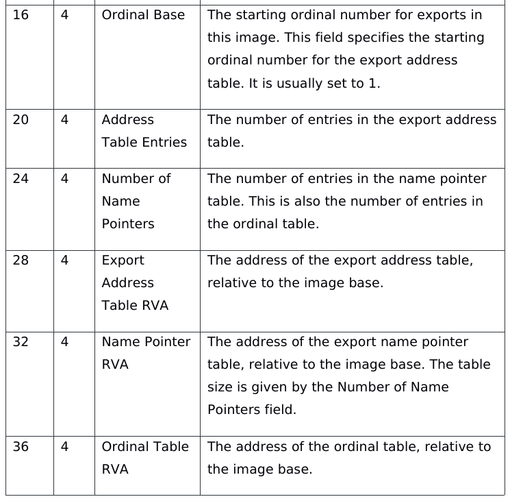
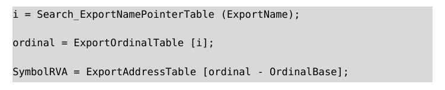
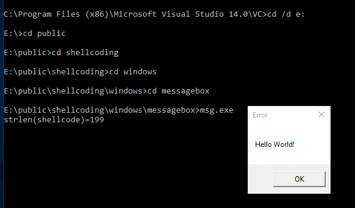

# 对照内核结构深入理解动态定位 API

图 / 文 N0viceLive <rectigu@gmail.com>

2015 年 8 月

## tl, dr

我们先理清总体的方向。动态定位 API 有如下几个重要步骤。

1. 获取 kernel32.dll 的加载基址。
2. 获取 GetProcAddress 的地址。

有了这两个地址，其他的函数（比如说 LoadLibrary）就都好办了。

接下来我们依次详细看看这两个目标是如何实现的。

## 代码

文中的所有代码均可在下面的仓库中找到。
除了文中的代码，该仓库还包含其他相关的代码与实用工具。

请前往 [shellcoding](https://github.com/NoviceLive/shellcoding)。

## 利用 PEB->Ldr 获取 kernel32.dll 的基址

Windows 内核模式使用 ETHREAD / KTHREAD、EPROCESS / KPROCESS
来描述线程、进程的结构，
他们在用户模式的类似结构就是 TEB 与 PEB。
不过 TEB、PEB 与他们的定义都在 ntoskrnl.exe 之中。

我们可以用 WinDbg 查看他们的定义。

```
lkd> dt nt!_TEB
   +0x000 NtTib            : _NT_TIB
   +0x01c EnvironmentPointer : Ptr32 Void
   +0x020 ClientId         : _CLIENT_ID
   +0x028 ActiveRpcHandle  : Ptr32 Void
   +0x02c ThreadLocalStoragePointer : Ptr32 Void
   +0x030 ProcessEnvironmentBlock : Ptr32 _PEB
   /* tl, dr */
```

```
lkd> dt nt!_PEB
   +0x000 InheritedAddressSpace : UChar
   +0x001 ReadImageFileExecOptions : UChar
   +0x002 BeingDebugged    : UChar
   +0x003 SpareBool        : UChar
   +0x004 Mutant           : Ptr32 Void
   +0x008 ImageBaseAddress : Ptr32 Void
   +0x00c Ldr              : Ptr32 _PEB_LDR_DATA
   /* tl, dr */
```

上面的片段截取自 Windows XP with SP3。

PEB（进程环境块）中包含加载模块的信息（Ldr 成员），其中就包括了 kernel32.dll。
PEB 本身则可以通过 TEB（线程环境块）中的 ProcessEnvironmentBlock 成员找到，
而 TEB 在 IA32 架构 Windows 位于 fs 段寄存器，在 AMD64 则位于 gs 段寄存器。

我们以 IA32 环境举例。

下面的代码片段将 PEB 的地址放入 ecx 寄存器。

```
    xor ecx, ecx
    mov ecx, dword ptr fs:[ecx + 30h]
```

我们对照一下 PEB->Ldr 的结构，其中 InLoadOrderModuleList、InMemoryOrderModuleList 与
InInitializationOrderModuleList 依次为加载顺序模块列表、
内存顺序模块列表与初始化顺序模块列表。

```
lkd> dt nt!_PEB_LDR_DATA
   +0x000 Length           : Uint4B
   +0x004 Initialized      : UChar
   +0x008 SsHandle         : Ptr32 Void
   +0x00c InLoadOrderModuleList : _LIST_ENTRY
   +0x014 InMemoryOrderModuleList : _LIST_ENTRY
   +0x01c InInitializationOrderModuleList : _LIST_ENTRY
   +0x024 EntryInProgress  : Ptr32 Void
```

LIST_ENTRY 包含两个指向 LIST_ENTRY 结构的指针，用来将同构或者异构的结构链接成（循环）双向链表。

```
lkd> dt nt!_LIST_ENTRY
   +0x000 Flink            : Ptr32 _LIST_ENTRY
   +0x004 Blink            : Ptr32 _LIST_ENTRY
```

我们使用初始化顺序模块列表来定位 kernel32.dll。

```
    mov ecx, dword ptr [ecx + 0ch]
    mov ecx, dword ptr [ecx + 1ch]
```

这时, ecx 寄存器为 PEB->Ldr->InInitializationOrderModuleList，
他的 Flink 成员指向一个 LDR_DATA_TABLE_ENTRY 结构的 LIST_ENTRY 类型成员,
InInitializationOrderLinks。
顺着往前遍历，我们一定会遇见 kernel32.dll 的。

对照 LDR_DATA_TABLE_ENTRY 结构，
ecx + 8 就是 DllBase 了，不过这还不是 kernel32.dll 的基址。

```
lkd> dt nt!_LDR_DATA_TABLE_ENTRY
   +0x000 InLoadOrderLinks : _LIST_ENTRY
   +0x008 InMemoryOrderLinks : _LIST_ENTRY
   +0x010 InInitializationOrderLinks : _LIST_ENTRY
   +0x018 DllBase          : Ptr32 Void
   +0x01c EntryPoint       : Ptr32 Void
   +0x020 SizeOfImage      : Uint4B
   +0x024 FullDllName      : _UNICODE_STRING
   +0x02c BaseDllName      : _UNICODE_STRING
   /* tl, dr */
```

我们可以通过这个结构的 BaseDllName 成员来确定我们遍历到的结点是不是
kernel32.dll 结点。这是一个 UNICODE_STRING，注意一个字符是两个字节。


```
lkd> dt nt!_UNICODE_STRING
   +0x000 Length           : Uint2B
   +0x002 MaximumLength    : Uint2B
   +0x004 Buffer           : Ptr32 Uint2B
```

BaseDllName 在 LDR_DATA_TABLE_ENTRY 中的偏移为 0x2c，
Buffer 在 UNICODE_STRING 中的偏移为 0x4，
那么，0x2c + 0x4 也就是 0x30，减去 0x10（读者想想，为什么？），
所以 edx + 20h 就是 UNICODE_STRING 的 Buffer。

判断 Buffer 的第 7 个字符是不是 '3'，第 7 个字符的偏移为 (7 - 1) * 2，
也就是 12，或者 0xc。

如果是，说明我们找到了 kernel32.dll 的结点，如果不是，那就继续向前遍历。

代码片段如下。

```
find_kernel32_dll_base:
    mov ebx, dword ptr [ecx + 8]
    mov eax, dword ptr [ecx + 20h]
    mov ecx, dword ptr [ecx]

    cmp byte ptr [eax + 0ch], 33h
    jne find_kernel32_dll_base
```

## 搜索 kernel32.dll 导出表获取 GetProcAddress 的地址

接下来，我们详细看看在找到了 kernel32.dll 的基址之后，
该怎样获取 GetProcAddress 的地址。

kernel32.dll 是一个映像文件，也就是通常所说的 PE 文件。所以我们要做的也就是
遍历这个 PE 文件的导出表，找到 GetProcAddress。

我们现在已经获取到了 kernel32.dll 的加载基址，也就是 DOS 头的地址。

```
lkd> dt nt!_IMAGE_DOS_HEADER
   +0x000 e_magic          : Uint2B
   +0x002 e_cblp           : Uint2B
   +0x004 e_cp             : Uint2B
   +0x006 e_crlc           : Uint2B
   +0x008 e_cparhdr        : Uint2B
   +0x00a e_minalloc       : Uint2B
   +0x00c e_maxalloc       : Uint2B
   +0x00e e_ss             : Uint2B
   +0x010 e_sp             : Uint2B
   +0x012 e_csum           : Uint2B
   +0x014 e_ip             : Uint2B
   +0x016 e_cs             : Uint2B
   +0x018 e_lfarlc         : Uint2B
   +0x01a e_ovno           : Uint2B
   +0x01c e_res            : [4] Uint2B
   +0x024 e_oemid          : Uint2B
   +0x026 e_oeminfo        : Uint2B
   +0x028 e_res2           : [10] Uint2B
   +0x03c e_lfanew         : Int4B
```

DOS 头中的 e_lfanew 是 NT 头的文件偏移地址。e_lfanew 的值加上之前我们定位到的
kernel32.dll 的基址，就是 NT 头在内存中的位置了。

下面的代码片段将 NT 头的内存地址放入 ebp 寄存器。

```
    mov ebp, ebx
    add ebp, dword ptr [ebp + 3ch]
```

我们看看 NT 头的结构。

```
lkd> dt nt!_IMAGE_NT_HEADERS
   +0x000 Signature        : Uint4B
   +0x004 FileHeader       : _IMAGE_FILE_HEADER
   +0x018 OptionalHeader   : _IMAGE_OPTIONAL_HEADER
```

导出表的虚拟地址位于可选头的数据目录中的第一项。看下面，可以知道
导出表距离 NT 头起始位置的偏移，0x18 + 0x60，也就是 0x78。

```
lkd> dt nt!_IMAGE_OPTIONAL_HEADER
   +0x000 Magic            : Uint2B
   +0x002 MajorLinkerVersion : UChar
   +0x003 MinorLinkerVersion : UChar
   +0x004 SizeOfCode       : Uint4B
   +0x008 SizeOfInitializedData : Uint4B
   +0x00c SizeOfUninitializedData : Uint4B
   +0x010 AddressOfEntryPoint : Uint4B
   +0x014 BaseOfCode       : Uint4B
   +0x018 BaseOfData       : Uint4B
   +0x01c ImageBase        : Uint4B
   +0x020 SectionAlignment : Uint4B
   +0x024 FileAlignment    : Uint4B
   +0x028 MajorOperatingSystemVersion : Uint2B
   +0x02a MinorOperatingSystemVersion : Uint2B
   +0x02c MajorImageVersion : Uint2B
   +0x02e MinorImageVersion : Uint2B
   +0x030 MajorSubsystemVersion : Uint2B
   +0x032 MinorSubsystemVersion : Uint2B
   +0x034 Win32VersionValue : Uint4B
   +0x038 SizeOfImage      : Uint4B
   +0x03c SizeOfHeaders    : Uint4B
   +0x040 CheckSum         : Uint4B
   +0x044 Subsystem        : Uint2B
   +0x046 DllCharacteristics : Uint2B
   +0x048 SizeOfStackReserve : Uint4B
   +0x04c SizeOfStackCommit : Uint4B
   +0x050 SizeOfHeapReserve : Uint4B
   +0x054 SizeOfHeapCommit : Uint4B
   +0x058 LoaderFlags      : Uint4B
   +0x05c NumberOfRvaAndSizes : Uint4B
   +0x060 DataDirectory    : [16] _IMAGE_DATA_DIRECTORY
```

反映到代码里也就是。

```
    mov ebp, dword ptr [ebp + 78h]
```

此时，edx 中便是数据目录的第一项了。
VirtualAddress 成员加上 kernel32.dll 的基址就是导出表在内存中的地址。

```
lkd> dt nt!_IMAGE_DATA_DIRECTORY
   +0x000 VirtualAddress   : Uint4B
   +0x004 Size             : Uint4B
```

```
    add ebp, ebx
```

然而笔者在 WinDbg 里并没有找到导出目录（IMAGE_EXPORT_DIRECTORY）的定义。
翻了翻 PE 规范，发现那里有对导出目录的较为详细的描述。



不过幸运地是，笔者最后在 winnt.h 里找到了导出目录的定义。

```
typedef struct _IMAGE_EXPORT_DIRECTORY {
    DWORD   Characteristics;
    DWORD   TimeDateStamp;
    WORD    MajorVersion;
    WORD    MinorVersion;
    DWORD   Name;
    DWORD   Base;
    DWORD   NumberOfFunctions;
    DWORD   NumberOfNames;
    DWORD   AddressOfFunctions;     // RVA from base of image
    DWORD   AddressOfNames;         // RVA from base of image
    DWORD   AddressOfNameOrdinals;  // RVA from base of image
} IMAGE_EXPORT_DIRECTORY, *PIMAGE_EXPORT_DIRECTORY;
```

导出目录的 AddressOfNames 成员， 偏移 32，也就是 0x20，
为导出名字指针表的相对虚拟地址。

下面的代码片段将导出名字指针表的内存地址放入 eax 寄存器。

```
    mov eax, dword ptr [ebp + 20h]
    add eax, ebx
```

接下来我们可以开始搜索函数名字，我们要找的是 GetProcAddress。

```
    xor edx, edx
find_get_proc_address:
    mov esi, dword ptr [eax + edx * 4]
    add esi, ebx

    inc edx

    cmp dword ptr [esi], 'PteG'
    jne find_get_proc_address

    cmp dword ptr [esi + 4], 'Acor'
    jne find_get_proc_address
```

还是导出表，AddressOfNameOrdinals 成员，偏移 36，也就是 0x24，
为序号表的相对虚拟地址。

下面的代码片段将序号表的内存地址放入 esi 寄存器。

```
    mov esi, dword ptr [ebp + 24h]
    add esi, ebx
```

序号表与导出名字指针表一一对应。
这也就是我们为什么先在名字指针表里找到 GetProcAddress 的索引，
然后用这个索引在序号表里找序号，
最后用序号到导出地址表（相对虚拟地址位于导出目录的 AddressOfFunctions 成员）里找。
如下图（图片来自 PE 规范）。



值得说明的是，序号表是一个 word 数组，所以，一个成员两个字节。

```
    mov dx, word ptr [esi + edx * 2]

    mov esi, dword ptr [ebp + 1ch]
    add esi, ebx
```

OrdinalBase 通常为 1，所以在 shellcode 里就直接使用了硬编码的 1.

```
    mov esi, dword ptr [esi + edx * 4 - 4]
    add esi, ebx
```

此时，我们要找的函数已经位于 esi 寄存器了。

做点什么呢，
不弹计算器，弹个 Hello World! 吧。

我们可以用已有的 kernel32.dll 的基址和 GetProcAddress 获取
LoadLibrary 的地址，然后加载 user32.dll，再从 user32.dll 中获取
MessageBox 的地址。

弹个窗就可以优雅地 ExitProcess 了。



如果想做其他的各种神奇的事情，自己写吧。

完整代码加注释，还有 shellcode 自动提取脚本（自动到生成测试用的 C 源文件），
在这里！[shellcoding](https://github.com/NoviceLive/shellcoding)。

## 结论

本文结合相关结构详细地阐述了利用 PEB->Ldr 获取 kernel32.dll
基址与搜索导出表定位函数的方法。

至于定位 kernel32.dll 的其他方法，就留给伙伴们自己去玩吧。

PS. 我们可不是脚本小子。

## 推荐阅读

1. [dt（Display Type）](https://msdn.microsoft.com/en-us/library/windows/hardware/ff542772%28v=vs.85%29.aspx)

2. [Any Windows Version - Messagebox Shellcode (113 bytes)](https://www.exploit-db.com/exploits/28996/)

3. [Allwin URLDownloadToFile + WinExec + ExitProcess Shellcode](https://www.exploit-db.com/exploits/24318/)

4. Windwos PE 权威指南，第 11 章，动态加载技术

5. Practical Reverse Engineering，第 3 章，The Windows Kernel

6. 0day 安全，第 1 篇，漏洞利用原理（初级）
